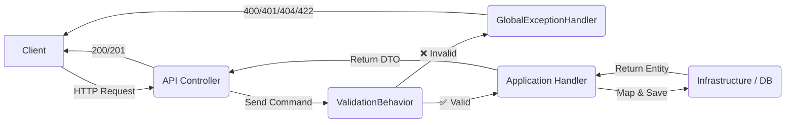

<div align="center">

# 🏗️ ARCHITECTURE

<p align="center">
  
  
</p>

---

### 🎯 Мета
Коротко пояснити, хто за що відповідає в архітектурі проекту та показати детальний шлях даних від клієнта до бази і назад

</div>

## 📂 Структура шарів

### 1️⃣ Domain
**Доменний рівень — серце програми.** Містить тільки бізнес-модель без прив'язки до бази даних або фреймворків.

* **Entities** — `Domain/Entities/Identity/UserEntity.cs`
* **Constants** — `FieldLengths`, `JwtClaims`, `AuthTokenConstants`, `AppTimeToLive` — `Domain/Constants/`
* **Exceptions** — `DomainException` — `Domain/Exceptions/`
* **Interfaces** — контракти репозиторіїв — `Domain/Interfaces/`

> [!IMPORTANT]
> **Правило:** домен нічого не знає про API, БД чи інфраструктурні сервіси. Жодних зовнішніх залежностей.

---

### 2️⃣ Application
Визначає варіанти використання системи (**UseCases**). Управляє бізнес-операціями, але не реалізує технічні деталі.

* **Commands/Queries** — `Application/UseCases/Account/Commands/`
* **Handlers** — `Application/UseCases/Account/Handlers/`
* **Validators** — `Application/UseCases/Account/Validators/`
* **Behaviors** — `ValidationBehavior`, `CachingBehavior`, `CacheInvalidationBehavior` — `Application/Behaviors/`
* **Common/Exceptions** — `ValidationException`, `BadRequestException`, `NotFoundException`, `UnauthorizedException`
* **Common/Validators** — `SharedValidationRules`, `ValidationMessages` (локалізація через `.resx`)
* **Common/Emails** — `EmailTemplates` — HTML шаблони листів
* **Common/Tokens** — `PasswordResetToken` — парсинг токенів
* **Interfaces** — `IJwtTokenService`, `IImageService`, `IEmailJobScheduler`, `ISmtpService`
* **Mappers** — AutoMapper профілі

**Принцип залежностей:** Application залежить від Domain, але не від Infrastructure.

---

### 3️⃣ Infrastructure
Реалізує технічні деталі: доступ до БД, зовнішні сервіси, файлове сховище.

* `Infrastructure/Data/AppDbContext.cs` — EF Core DbContext
* **Configurations** — `IEntityTypeConfiguration` для кожної сутності — `Infrastructure/Data/Configurations/`
* **Repositories** — реалізації інтерфейсів з Domain — `Infrastructure/Data/Repositories/`
* **Services** — `JwtTokenService`, `ImageService`, `SmtpService`, `EmailJobScheduler` — `Infrastructure/Services/`
* **Jobs** — `DbSeedJob`, `SendEmailJob` (Quartz) — `Infrastructure/Jobs/`
* **Middleware** — `GlobalExceptionHandler` — `Infrastructure/Middleware/`

> **Правило:** інфраструктура знає про Domain і Application, але не навпаки.

---

### 4️⃣ API
**Точка входу в систему.** Відповідає лише за HTTP маршрути та перетворення запиту в команду.

* **Controllers** — викликають MediatR, не містять бізнес-логіки
* **Extensions** — `WebApplicationBuilderExtensions`, `WebApplicationExtensions`

**Правила:**
* Контролер не містить бізнес-логіки
* Контролер повертає DTO, не доменні сутності

---

## 🔄 Повний шлях даних


---

## 🌍 Локалізація

Всі повідомлення про помилки зберігаються в ресурсних файлах і автоматично перемикаються залежно від заголовку запиту.
```
Application/Common/Resources/
├── ValidationMessages.resx      ← англійська (дефолт)
└── ValidationMessages.uk.resx   ← українська
```

Клієнт передає заголовок для вибору мови:
```http
Accept-Language: en   → English errors
Accept-Language: uk   → Українські помилки
```

---

## ✅ Валідація

Використовується **FluentValidation** у зв'язці з **MediatR Pipeline**. Валідація відбувається автоматично перед кожним Handler.

### 🔄 Flow валідації
```
HTTP Request
    ↓
API Controller → надсилає Command через MediatR
    ↓
ValidationBehavior → шукає валідатор для команди
    ↓
    ❌ є помилки → ValidationException
                        ↓
                 GlobalExceptionHandler
                        ↓
                 400 + JSON з помилками

    ✅ все ок → Handler виконується
                        ↓
                 200/201 відповідь
```

### 📂 Де знаходяться валідатори
```
Application/
└── UseCases/
    └── Account/
        ├── Commands/
        │   ├── LoginCommand.cs
        │   └── RegisterCommand.cs
        └── Validators/
            ├── LoginCommandValidator.cs
            └── RegisterCommandValidator.cs
```

### ✏️ Як написати валідатор

Використовуй `SharedValidationRules` — спільні правила з локалізованими повідомленнями:
```csharp
public class RegisterCommandValidator : AbstractValidator<RegisterCommand>
{
    public RegisterCommandValidator()
    {
        RuleFor(x => x.Email).EmailRules(ValidationMessages.FieldEmail);
        RuleFor(x => x.Password).PasswordRules(ValidationMessages.FieldPassword);
        RuleFor(x => x.FirstName).NameRules(ValidationMessages.FieldFirstName);
        RuleFor(x => x.LastName).NameRules(ValidationMessages.FieldLastName);
        RuleFor(x => x.PhoneNumber).PhoneRules();
        RuleFor(x => x.Bio).BioRules();
    }
}
```

> [!IMPORTANT]
> Валідатор реєструється автоматично через `AddValidatorsFromAssemblies` — нічого додатково реєструвати не потрібно.

### ⚠️ Обробка помилок

| Виняток | Статус | Коли кидати |
|---------|--------|-------------|
| `ValidationException` | 400 | Невалідні поля форми |
| `BadRequestException` | 400 | Логічна помилка (email вже зайнятий) |
| `UnauthorizedException` | 401 | Невірний логін або пароль |
| `NotFoundException` | 404 | Об'єкт не знайдено в БД |
| `DomainException` | 422 | Порушення бізнес-правил |
---

## 🧰 Redis — швидкий старт

Redis використовується як `IDistributedCache` для кешування запитів через `CachingBehavior`.

### Запустити Redis через Docker
```bash
docker run --name my-redis -p 6379:6379 -d redis
```

### Перевірити що працює
```bash
docker exec -it my-redis redis-cli ping
# → PONG
```

### Корисні команди
```bash
# підключитись
docker exec -it my-redis redis-cli

# переглянути всі ключі
keys *

# отримати значення ключа
get "Pinterest_users:all"

# режим реального часу
monitor
```

---

## 📧 Фонова відправка листів

Листи відправляються через **Quartz** у фоні — Handler не чекає завершення відправки.
```
Handler
    ↓
IEmailJobScheduler.ScheduleAsync()   ← миттєво повертається
    ↓
Quartz → SendEmailJob                ← відправляє у фоні
    ↓
SmtpService.SendEmailAsync()
```

HTML шаблони листів знаходяться в `Application/Common/Emails/EmailTemplates.cs`.

# 🧪 Робота з локальною базою даних

Щоб запустити проєкт локально з використанням PostgreSQL та Redis через Docker, виконайте наступні кроки.

---

## 🚀 1. Підняти локальні сервіси

Виконайте команду:

```bash
docker compose up -d
```

Це запустить:
- PostgreSQL (база даних)
- Redis (кеш)

---

## ⚙️ 2. Оновити конфігурацію під локальне середовище

Відкрийте файл `appsettings.json` і замініть на:

```json
"ConnectionStrings": {
  //"DefaultConnection": "Host=ep-delicate-smoke-al7y1tqn-pooler.c-3.eu-central-1.aws.neon.tech; Database=neondb; Username=neondb_owner; Password=npg_Gazj73FgJmQV;",
  "DefaultConnection": "Host=localhost;Port=5432;Database=myapp_db;Username=admin;Password=super_secret_password",
  "Redis": "localhost:6379"
},
//"ImagesDir": "images",
"ImagesDir": "localImages",
```

---

## 🗄️ 3. Ініціалізація бази даних

Після цього виконайте міграції:

```powershell
Update-Database
```

Це створить структуру бази даних відповідно до поточного стану моделей.

---

## ✅ Готово

Після виконання всіх кроків:
- база даних працює локально
- Redis доступний
- застосунок готовий до запуску

---


# 🗄️ Регламент роботи з базою даних (EF Core)

Щоб уникнути конфліктів у файлі `ModelSnapshot.cs` та помилок при злитті гілок, кожен член команди має дотримуватись цієї інструкції.

---

## 🚀 Стандартний робочий цикл

## Виконуйте ці кроки кожного разу, коли вам потрібно змінити структуру БД:


## 🛠 Вирішення конфліктів (Conflict Resolution)

Якщо ти створив міграцію, але при спробі зробити push виявилося, що в `main` уже є нові міграції від колег — виникне конфлікт.

**Не намагайтеся виправити Snapshot вручну!** Зробіть наступне:

1. **Відкотіть свою базу до останньої спільної міграції:**
   ```powershell
   Update-Database -Migration Назва_Останньої_Спільної_Міграції
   ```

2. **Видаліть файли своєї локальної міграції:**
   ```powershell
   Remove-Migration
   ```

3. **Підтягніть зміни з основної гілки:**
   ```powershell
   git pull origin main
   ```

4. **Накатіть міграції колег на свою базу:**
   ```powershell
   Update-Database
   ```

5. **Створіть свою міграцію заново:**
   ```powershell
   Add-Migration Назва_Твоєї_Міграції
   ```

6. **Застосуйте та відправляйте:**
   ```powershell
   Update-Database
   git push
   ```

---

## ⚠️ Важливі правила

- ❌ Заборонено видаляти файли міграцій через Провідник. Використовуйте лише команду:
  ```powershell
  Remove-Migration
  ```

- ❌ Не змінюйте назви файлів міграцій вручну — це зламає `.Designer.cs`.

