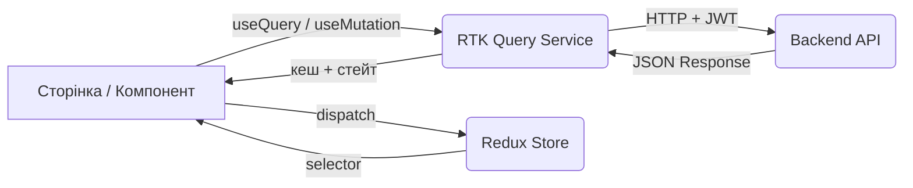

<div align="center">

# 🎨 FRONTEND


### React 19 · TypeScript · Vite · Tailwind CSS v4

</div>

---

## 📂 Структура проекту

```
src/
├── assets/          ← іконки, зображення, дефолтні фото
├── components/      ← повторно використовувані компоненти
│   ├── admin/       ← таблиці, модалки, фільтри адмін-панелі
│   ├── auth/        ← LoginForm, RegisterForm, ForgotPassword...
│   ├── header/      ← Header, LanguageSwitcher
│   ├── moodboard/   ← CreateMoodboardForm
│   ├── navigation/  ← BottomNav (мобільна навігація)
│   ├── sidebar/     ← Sidebar, ChatWindow
│   └── ui/          ← Modal, PinCard, Toast, ComboboxInput, BirthDatePicker...
├── constants/       ← env, countries, languages
├── context/         ← ThemeContext, LoadingContext
├── hooks/           ← useApiError, useImageCrop...
├── i18n/            ← ініціалізація i18next
├── layouts/         ← MainLayout, AdminLayout
├── pages/           ← сторінки за роутами
│   ├── admin/       ← Users, Pins, Boards, Categories, Tags, Reports, News
│   ├── aura/        ← CreateAuraPage, EditAuraPage, AuraPreviewPage
│   ├── auth/        ← AuthPage
│   ├── collections/ ← CollectionsPage, ArchivedMoodboardsPage
│   ├── home/        ← HomePage
│   ├── moodboard/   ← MoodboardPreviewPage, MoodboardSectionPreviewPage
│   ├── profile/     ← ProfilePage
│   └── ...
├── services/        ← RTK Query API-сервіси
├── store/           ← Redux store, slices, selectors
├── types/           ← TypeScript типи та інтерфейси
└── utils/           ← slugify, chatHub, helpers
```

---

## 🛠️ Tech Stack

| Категорія | Технологія |
|---|---|
| Фреймворк | React 19 |
| Мова | TypeScript 5.9 |
| Збірка | Vite 8 |
| Стилі | Tailwind CSS v4 |
| Стейт / API | Redux Toolkit + RTK Query |
| Роутинг | React Router v7 |
| Форми | React Hook Form + Zod |
| Real-time | SignalR (`@microsoft/signalr`) |
| Локалізація | i18next (uk / en) |
| Авторизація | JWT + Google OAuth (`@react-oauth/google`) |
| Редактор | TinyMCE (`@tinymce/tinymce-react`) |
| Аватар/кроп | react-easy-crop |
| Графіки | Chart.js + react-chartjs-2 |
| Анімації | Framer Motion |

---

## 🚀 Запуск локально

### 1. Встановити залежності
```bash
npm i --legacy-peer-deps
```

### 2. Налаштувати змінні середовища

Створіть файл `.env` у корені папки `frontend-pinterest/`:

```env
VITE_API_URL=https://localhost:7001
VITE_IMAGES_URL=https://localhost:7001/images/
```

### 3. Запустити dev-сервер
```bash
npm run dev
```

Застосунок буде доступний за адресою: `http://localhost:5173`

### 4. Збірка для production
```bash
npm run build
```

---

## 🔄 Архітектура даних



### RTK Query — сервіси

Кожен ресурс має свій сервіс у `src/services/`:

```
services/
├── api.ts                    ← базовий createApi з JWT interceptor
├── accountService.ts         ← login, register, editProfile, getMe...
├── pinService.ts             ← createPin, updatePin, deletePin, getAll...
├── moodboardService.ts       ← create/update/delete/archive boards
├── boardSectionService.ts    ← секції всередині дошок
├── commentService.ts         ← CRUD коментарів
├── likeService.ts            ← лайки пінів
├── followService.ts          ← підписки між користувачами
├── chatService.ts            ← чати + SignalR
├── notificationService.ts    ← сповіщення
├── reportService.ts          ← скарги на піни
├── newsService.ts            ← новини (адмін)
├── categoryService.ts        ← категорії (адмін)
├── tagService.ts             ← теги (адмін)
├── statisticsService.ts      ← статистика (адмін)
└── userService.ts            ← пошук користувачів
```

### Redux Store

```
store/
├── index.ts              ← конфігурація store
├── slices/
│   └── authSlice.ts      ← user, accessToken, isAuthenticated
└── selectors/
    └── authSelectors.ts  ← selectUser, selectIsAdmin, selectIsAuthenticated
```

---

## 🌍 Локалізація

Підтримуються дві мови: **Українська** та **English**.

Файли перекладів знаходяться в `public/locales/`:

```
public/locales/
├── uk/
│   ├── common.json    ← загальні: навігація, кнопки, sidebar
│   ├── auth.json      ← реєстрація, вхід, скидання пароля
│   ├── boards.json    ← мудборди, секції
│   ├── admin.json     ← адмін-панель
│   └── profile.json   ← профіль користувача
└── en/
    └── ...            ← аналогічна структура
```

Мова визначається автоматично з браузера та зберігається в `localStorage`. Перемикач — компонент `LanguageSwitcher` у хедері.

#### Використання в компоненті

```tsx
const { t } = useTranslation('common');

<p>{t('sidebar.settings')}</p>
```

> [!IMPORTANT]
> При додаванні нового тексту — додавай переклади **одразу в обидва** файли (`uk` і `en`).

---

## 🔐 Авторизація

Токени зберігаються в `localStorage`. При кожному запиті RTK Query автоматично додає `Authorization: Bearer <token>` через `prepareHeaders` у `src/services/api.ts`.

При отриманні `401` — виконується автоматичне оновлення токену (`refresh`). Якщо refresh не вдався — користувач розлогінюється.

```
src/services/api.ts
    └── prepareHeaders()     ← додає Bearer токен
    └── reauth middleware    ← перехоплює 401, оновлює токен
```

---

## ⏳ Глобальний лоадер

`LoadingContext` — лічильник активних запитів. Компонент `GlobalLoadingOverlay` показує оверлей поки є хоч один активний запит.

```tsx
const { withLoading } = useLoading();

// обгортай будь-який async виклик:
await withLoading(() => createPin(data).unwrap());
```

Підтримує вкладені виклики — лоадер зникає тільки коли **всі** запити завершились.

---

## 💬 Real-time (SignalR)

Чат та сповіщення працюють через WebSocket з'єднання.

```
src/utils/chatHub.ts   ← підключення / відключення / обробники подій
```

З'єднання встановлюється після авторизації та зупиняється при логауті.

---

## 🎨 Теми оформлення

Підтримуються **темна** та **світла** теми через `ThemeContext`.

```tsx
const { theme, toggleTheme } = useTheme();
```

Tailwind клас `dark:` активується через атрибут `class="dark"` на `<html>`. CSS-змінні кольорів задані в `src/index.css`.

---

## 📱 Адаптивність

- **Desktop** (`md+`): повноцінний sidebar зліва + header зверху
- **Mobile** (`< md`): `BottomNav` знизу екрана, sidebar прихований

---

## ✅ Правила розробки

- Новий API-ендпоінт → створюй endpoint у відповідному сервісі в `services/`
- Нова сторінка → додавай роут у `App.tsx`
- Мутації з UI-блокуванням → обгортай у `withLoading()`
- Новий текст в UI → одразу додавай переклад в `uk` і `en` локалі
- Компонент використовується більше ніж в 1 місці → виноси в `components/ui/`
